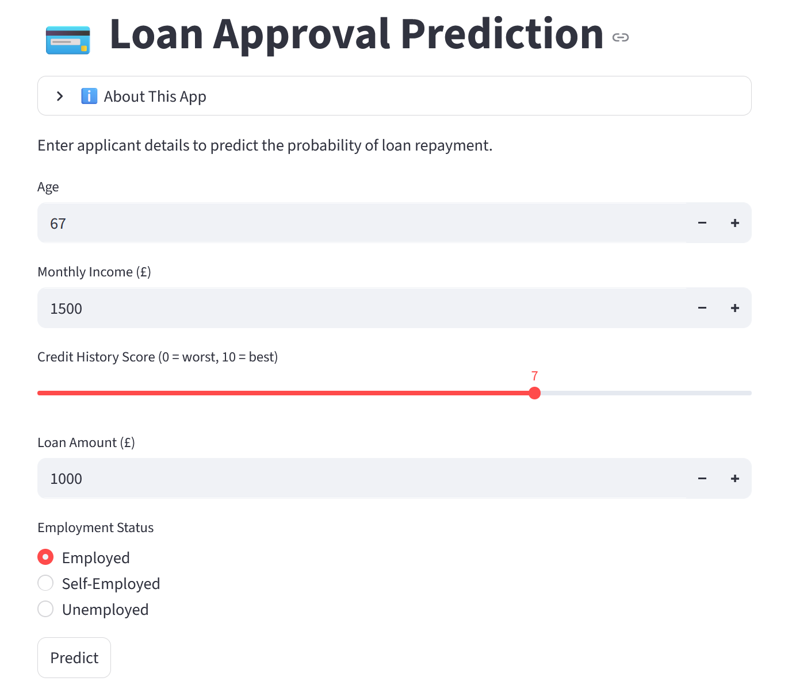
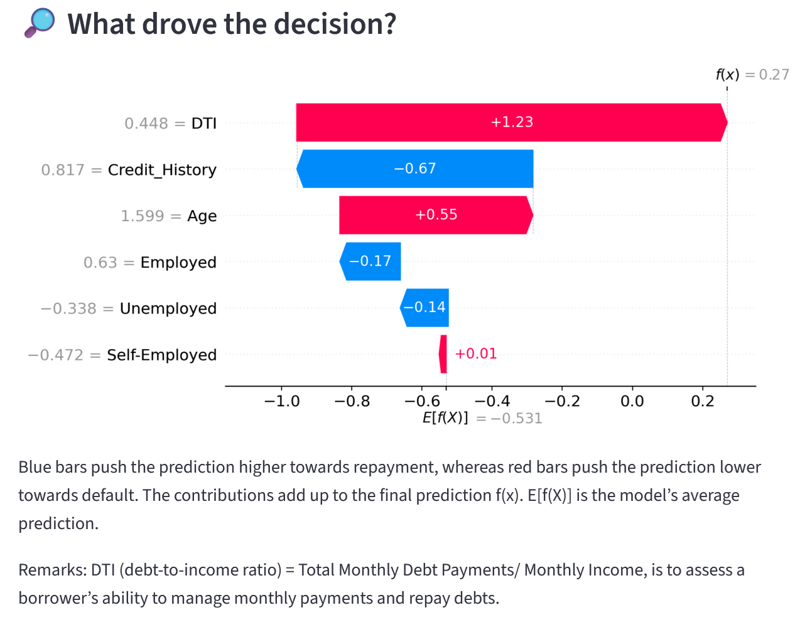
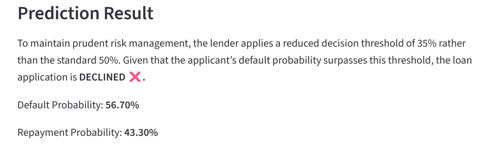
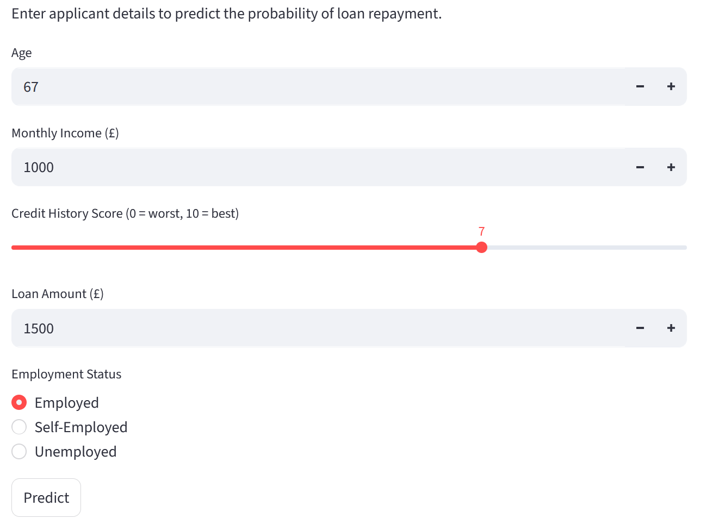

# Loan Approval Prediction App using Logistic Regression

An end-to-end loan approval prediction [application](https://creditscoringprediction.streamlit.app/) using Logistic Regression to model borrower default risk, with SHAP-based explainability and a Streamlit app for interactive what-if analysis and decision support.

---

## Highlights

- Built a **full pipeline** from raw loan data to a deployed, interactive credit scoring interface.
- Engineered a **Debt-to-Income (DTI) ratio** feature and transformed employment status into machine-readable dummy variables.
- Trained a **Logistic Regression** model (with class weighting and feature scaling) to predict borrower default.
- Evaluated the model with **recall**, **PR-AUC**, **ROC-AUC**, and **F1-score**, focusing on catching true defaulters.
- Implemented **SHAP explainability** to expose feature contributions at the individual applicant level.
- Deployed the trained model, scaler, and SHAP explainer via a Streamlit app that returns probabilities, approval decisions, and a SHAP waterfall plot.

---

## Skills Demonstrated

✔ Supervised learning for binary classification  

✔ Credit risk modelling and loan approval decisioning  

✔ Feature engineering for financial datasets (DTI, categorical encoding)  

✔ Model evaluation and interpretation (coefficients, SHAP, classification metrics)  

✔ Handling class imbalance with `class_weight="balanced"`  

✔ Persisting models and scalers (pickle)  

---

## Problem Statement

Financial institutions must assess borrower creditworthiness to minimize default risk, but manual or rule-based approaches can be inconsistent and suboptimal. This project aims to build an interpretable, data-driven model that predicts whether a borrower will default on a loan and to operationalize that model in a way that supports consistent, transparent loan approval decisions.

---

## Project Overview

> **Note:**  
> *This Streamlit application is hosted on the free Tier of Streamlit Community Cloud. If the app has been idle for more than 12 hours, it may take some time to reactivate. In such cases, please click the button saying “Yes, get this app back up!” to relaunch the application. Thank you for your patience.*

A [loan dataset from Kaggle](https://www.kaggle.com/datasets/taweilo/loan-approval-classification-data) is used to model borrower default behavior. 

1. Load and clean the dataset (drop non-predictive identifiers and redundant columns such as `Client_ID` and `Gender`).
2. Engineer risk-relevant features, notably the Debt-to-Income (DTI) ratio derived from monthly income and repayment amounts.
3. Encode employment status as dummy variables (`Employed`, `Self-Employed`, `Unemployed`) to represent employment types numerically.
4. Use Logistic Regression to predict the binary `Default_Flag` (default vs non-default) based on features including age, DTI, credit history, and employment.
5. Evaluate performance with multiple classification metrics, emphasizing recall for defaulters and precision–recall/ROC curves.
6. Build a SHAP explainer to provide local (per-applicant) feature attribution.
7. Deploy the final model, scaler, and SHAP explainer in a Streamlit app that accepts user inputs, returns predicted default/repayment probabilities, applies an explicit decision threshold, and visualizes the drivers of each decision through a SHAP waterfall plot.

---

## Key Values & Impacts

Deploying an automated, explainable loan approval and credit scoring [application](https://creditscoringprediction.streamlit.app/) delivers tangible business value across lending operations:

- **Improved Credit Decision Consistency**: Standardized risk scoring removes subjective variations, producing repeatable and defensible credit decisions that align with internal credit policy.

- **Risk Reduction Through Early Default Detection**: Higher recall on defaulters helps reduce credit losses by catching high-risk applicants before origination rather than through collections or charge-offs.

- **Operational Efficiency & Reduced Cycle Times**: Automated assessment shortens decision-making from minutes/hours to milliseconds, increasing application throughput and reducing the need for manual underwriting for straightforward cases.

- **Portfolio-Level Risk Control via Threshold Adjustment**: The default probability threshold offers a tunable risk lever, allowing risk teams to balance approval volume versus risk appetite depending on market conditions and strategic objectives.

- **Enhanced Transparency & Explainability for Stakeholders**: SHAP waterfall plots make each approval or decline auditable and interpretable, supporting compliance requirements, model governance, and fair-lending discussions.

---

## Key Technical Decisions

### Algorithm Choice

**Logistics regression** is chosen with considerations of:
- Interpretability and suitability in credit risk settings.
- The model’s coefficients map directly to the direction and strength of each feature’s influence on default vs repayment, which is important for explainability and potential regulatory scrutiny.

### Feature Engineering

- Created **DTI** from income and repayment to capture leverage and repayment burden.  
- **One-hot encoded** the `Employment` categorical variable, then converted booleans (`True`/`False`) into numeric form (`1`/`0`).  
- Dropped redundant raw columns (`Monthly_Income`, `Monthly_Repayment`, original `Employment`) once the engineered variables were in place.

### Scaling Strategy

- Used **StandardScaler** to standardize features before training Logistic Regression.
- Logistic Regression benefits from standardized feature variance: scaling features to zero mean and unit variance improves solver stability and makes coefficients more directly comparable across features. This is more suitable here than MinMax scaling, which mainly rescales to a fixed range and is less convenient for interpreting linear model coefficients.
- The fitted scaler is persisted and reused in the application to ensure consistent preprocessing between training and inference.

### Class Imbalance Handling

- Set `class_weight="balanced"` in Logistic Regression to give additional weight to the minority class (defaulters), reducing the risk of a high-accuracy but low-recall model on defaults.

### Evaluation Focus

- Evaluated the model using recall, PR-AUC, ROC-AUC, accuracy, precision, and F1-score.  
- Particular emphasis on recall for defaulters and PR-AUC to ensure genuine defaults are captured with acceptable levels of false positives.

### Prudent Operational Threshold

Instead of using a naïve 50% default probability cutoff, a more conservative decision threshold of **35% default probability** is used in the Streamlit app:

- Default probability **≤ 35%** → **“APPROVED”**  
- Default probability **> 35%** → **“DECLINED”**

This reflects the lender’s risk tolerance and aligns the model with business policy.

---

## Stages of Development

1. **Problem Framing & Design**  
   - Defined the business problem as predicting borrower default to support loan approval decisions, with a need for interpretability and explainability.

2. **Data Ingestion & Cleaning**  
   - Imported the [Kaggle Loan Approval Classification dataset](https://www.kaggle.com/datasets/taweilo/loan-approval-classification-data).  
   - Dropped non-informative columns (`Client_ID`, `Gender`).  
   - Removed duplicates and checked for missing values.

3. **Feature Engineering & Transformation**  
   - Created `DTI = Monthly_Repayment / Monthly_Income`.  
   - One-hot encoded `Employment` into `Employed`, `Self-Employed`, and `Unemployed`.  
   - Converted dummy columns to numeric (1/0) and dropped original employment and raw income/repayment columns as needed.

4. **Train/Test Split & Scaling**  
   - Split data into training (70%) and test (30%) sets.  
   - Applied `StandardScaler` to the training features and transformed the test features with the same scaler.

5. **Model Training**  
   - Trained `LogisticRegression(class_weight="balanced", max_iter=1000, random_state=42)` on scaled features.  
   - Inspected coefficients and odds ratios to understand the relative importance and directionality of each feature.

6. **Evaluation & Diagnostics**  
   - Generated predictions and confusion matrix.  
   - Calculated key metrics: recall for default class, PR-AUC, ROC-AUC, precision, F1-score.  
   - Interpreted metric values in the context of risk tolerance and desired trade-offs.

7. **Explainability Integration**  
   - Constructed a SHAP explainer using the trained model and training data.  

8. **Model & Artifact Persistence**  
   - Serialized and saved:
     - `credit_model.pkl` – trained Logistic Regression model  
     - `credit_scaler.pkl` – fitted `StandardScaler`  
     - `credit_explainer.pkl` – SHAP explainer  

9. **Streamlit App Development & Deployment**  
   - Built the Streamlit front-end that loads the saved artifacts and provides real-time predictions, explanations, and approval decisions.

---

## Technologies Used (Model Explanation)

### Python & Data Stack

- **pandas**, **NumPy** for data manipulation and feature engineering.  
- **matplotlib**, **seaborn** for exploratory data analysis and visualization.

### Modeling (scikit-learn)

- `LogisticRegression` for binary classification of `Default_Flag`.  
- `StandardScaler` for feature standardization.  
- `train_test_split` for splitting data into training and test sets.  
- `classification_report`, `confusion_matrix`, `roc_auc_score`, `average_precision_score`, `recall_score` for model evaluation.

### Explainability (SHAP)

- `shap.Explainer` built on the trained Logistic Regression model and training data.  
- SHAP waterfall plots to show the contribution of each feature to an individual prediction, highlighting which factors push the score towards default or repayment.

### Model Persistence (pickle)

- `pickle.dump` and `pickle.load` used to serialize and reload the model, scaler, and SHAP explainer for deployment.

### App Framework (Streamlit)

- Streamlit provides a lightweight web interface to:
  - Collect applicant inputs  
  - Invoke the model pipeline  
  - Display predictions, decisions, and SHAP-based explanations  

---

## Streamlit Application

### Inputs

- `Age` (numeric input, 18–100)  
- `Monthly Income (£)` (numeric input)  
- `Credit History Score` (slider from 0 = worst to 10 = best)  
- `Loan Amount (£)` – used with income to compute DTI  
- `Employment Status` – radio selection: `Employed`, `Self-Employed`, or `Unemployed`

### Feature Construction in the App

- Computes DTI in real time: `DTI = Loan Amount / Monthly Income`.  
- Converts selected employment status into dummy variables (`Employed`, `Self-Employed`, `Unemployed`).  
- Assembles a single-row `DataFrame` with the same feature schema used in training:  
  `['Age', 'DTI', 'Credit_History', 'Employed', 'Self-Employed', 'Unemployed']`.  
- Applies the persisted scaler (`credit_scaler.pkl`) to standardize the input.

### Prediction & Decision Logic

- Uses the loaded Logistic Regression model (`credit_model.pkl`) to compute:  
  - `prob_default` – probability of default (class 1)  
  - `prob_repay` – probability of repayment/non-default (class 0)  

- Applies the 35% default probability threshold:
  - `prob_default ≤ 0.35` → loan application **“APPROVED ✅”**  
  - `prob_default > 0.35` → loan application **“DECLINED ❌”**  

### Explainability & Visual Output

- Invokes the loaded SHAP explainer (`credit_explainer.pkl`) on the scaled input row.  
- Generates a SHAP waterfall plot for that applicant, embedded directly into the app.  
- Displays descriptive text to help users interpret:
  - Blue bars: factors pushing the prediction towards repayment  
  - Red bars: factors pushing the prediction towards default
    
---

## Author

Carmen Wong
