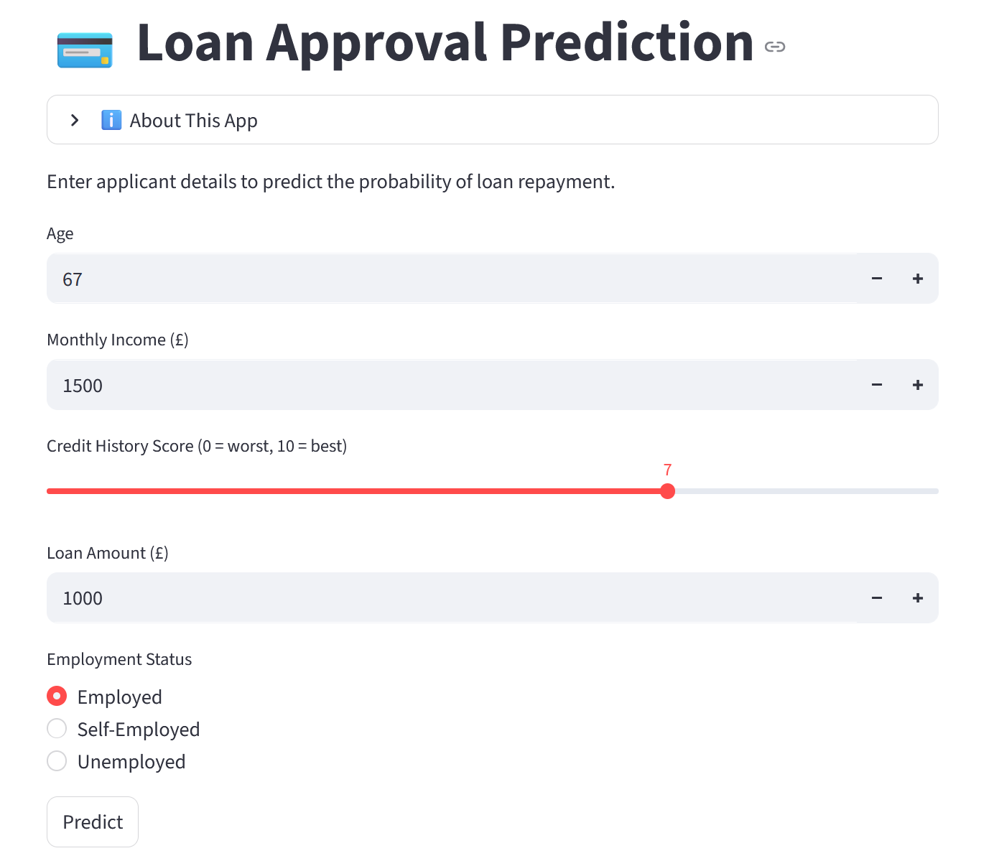
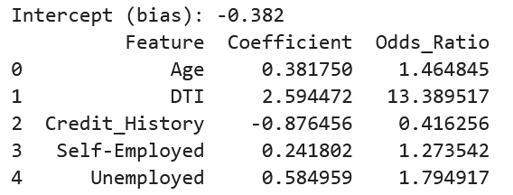
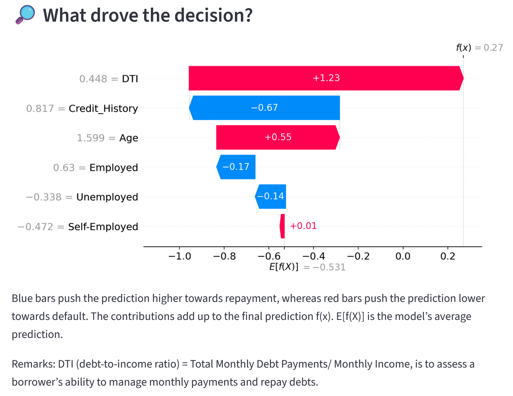
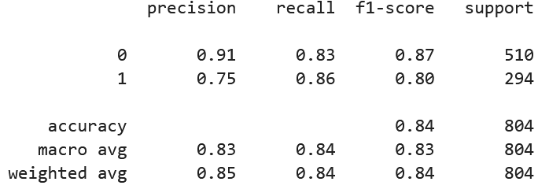
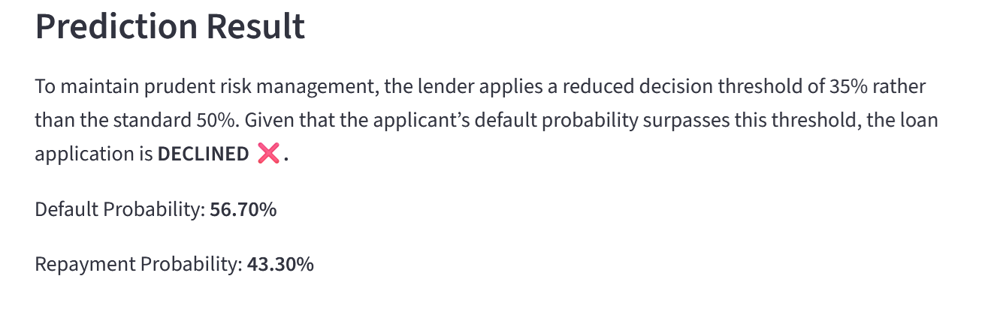

# Loan Approval Prediction App using Logistic Regression

An end-to-end [loan approval prediction application](https://creditscoringprediction2.streamlit.app/) using Logistic Regression to model borrower default risk, with SHAP-based explainability and a Streamlit app for interactive what-if analysis and decision support.

*Please click [here](https://youtu.be/psohqe_YtE4) for video demo.*

---

## Skills Demonstrated

✔ Supervised learning for **binary classification**

✔ Credit risk modelling and loan approval decisioning using **Logistic Regression**

✔ **Feature engineering** for financial datasets, including feature creation (Debt-to-Income (DTI) ratio) and categorical encoding (One-Hot encoding)

✔ Model evaluation and interpretation (recall, precision, F1-score, PR-AUC, ROC-AUC, and **SHAP explainability**)  

✔ Handling **class imbalance** with `class_weight="balanced"`  

✔ Persisting models and scalers (pickle) for deployment of Streamlit application

---

## Problem Statement

Financial institutions assess borrower creditworthiness to minimize default risk, but manual or rule-based approaches can be inconsistent and suboptimal. This project aims to build an interpretable, data-driven model that predicts whether a borrower will default on a loan and to operationalize that model in a way that supports consistent, transparent loan approval decisions.

---

## Overview

> **Note:**  
> *This [Streamlit application](https://creditscoringprediction2.streamlit.app/) is hosted on the free Tier of Streamlit Community Cloud. If the app has been idle for more than 12 hours, it may take some time to reactivate. In such cases, please click the button saying “Yes, get this app back up!” to relaunch the application. Thank you for your patience.*

A [loan dataset from Kaggle](https://www.kaggle.com/datasets/taweilo/loan-approval-classification-data) is used to model borrower default behavior. 

1. Load and clean the dataset (drop non-predictive identifiers and redundant columns such as `Client_ID` and `Gender`).
2. Engineer risk-relevant features, notably the Debt-to-Income (DTI) ratio derived from monthly income and repayment amounts.
3. Encode employment status as dummy variables to represent employment types numerically. 
4. Use Logistic Regression to predict the binary `Default_Flag` (default = 1 vs non-default = 0) based on financial and demographic features.
5. A higher positive coefficient in Logistic Regression represents a higher probability of repayment, whereas a more negative coefficient suggests a higher probability of default. DTI ratio is found to be the main driver of whether the loan would default.
   

6. Evaluate performance with multiple classification metrics, emphasizing  for missing of defaulters  – F1 Score, PR Curve and ROC Curve.
7. Build a SHAP explainer to show the specific reasons why an individual’s loan was approved or denied.
8. Deploy the final model, scaler, and SHAP explainer in a Streamlit app that accepts user inputs, returns predicted default/repayment probabilities, applies an explicit decision threshold, and visualizes the drivers of each decision through a SHAP waterfall plot.

---

## Key Values & Impacts

Deploying an automated, explainable loan approval and credit scoring [application](https://creditscoringprediction2.streamlit.app/) delivers tangible business value across lending operations:

- **Improved Credit Decision Consistency**: Standardized risk scoring removes subjective variations, producing consistent credit decisions that align with internal credit policy.

- **Risk Reduction Through Early Default Detection**: Higher  on defaulters helps reduce credit losses by catching high-risk applicants rather than through collections or charge-offs.

- **Operational Efficiency & Reduced Cycle Times**: Automated assessment shortens decision-making from minutes/hours to milliseconds, increasing application throughput and reducing the need for manual underwriting for straightforward cases.

- **Portfolio-Level Risk Control via Threshold Adjustment**: The default probability threshold offers a tunable risk lever, allowing risk teams to balance approval volume versus risk appetite depending on market conditions and strategic objectives.

- **Enhanced Transparency & Explainability for Stakeholders**: SHAP waterfall plots make each approval or decline interpretable, supporting compliance requirements and model governance.

---

## Key Technical Decisions

### Algorithm Choice

**Logistics regression** is chosen, with the considerations of:
- Interpretability and suitability in credit risk settings.
- The model’s coefficients map directly to the direction and strength of each feature’s influence on default vs repayment, which is important for explainability and potential regulatory scrutiny.

### Feature Engineering
- Created **DTI** from income and repayment to capture leverage and repayment burden.  
- **One-hot encoded** the `Employment` categorical variable, then converted booleans (`True`/`False`) into numeric form (`1`/`0`). `drop_first=True` is used to avoid multicollinearity of features. When both `Self-Employed` and `Unemployed` equal 0, this will mean the applicant is employed. 
- Dropped irrelevant (`Client_ID` and `Gender`) and redundant raw columns (`Monthly_Income`, `Monthly_Repayment`, original `Employment`) once the engineered variables were in place.

### Scaling Strategy
- Used **StandardScaler** to standardize features before training Logistic Regression.
- Logistic Regression benefits from standardized feature variance: scaling features to zero mean and unit variance improves solver stability and makes coefficients more directly comparable across features. This is more suitable here than MinMax scaling, which mainly rescales to a fixed range and is less convenient for interpreting linear model coefficients.
- The fitted scaler is persisted and reused in the application to ensure consistent preprocessing between training and inference.

### Class Imbalance Handling
- Set `class_weight="balanced"` in Logistic Regression to give additional weight to the minority class (defaulters), reducing the risk of a high-accuracy but low- model on defaults.

### Evaluation Focus
- Evaluated the model using recall, F1-score, PR-AUC and ROC-AUC.  
- Particular emphasis on recall for defaulters and PR-AUC to ensure genuine defaults are captured with acceptable levels of false positives.

### Prudent Operational Threshold
Instead of using a naïve 50% default probability cutoff, a more conservative decision threshold of **35% default probability** is used in the Streamlit app:

- Default probability **≤ 35%** → **“APPROVED”**  
- Default probability **> 35%** → **“DECLINED”**

This reflects the lender’s risk tolerance and aligns the model with business policy.

---

## Development Pipeline

1. **Data Preparation**: Loaded [Kaggle loan dataset](https://www.kaggle.com/datasets/taweilo/loan-approval-classification-data); removed non-informative identifiers; handled duplicates and missing values.

2. **Feature Engineering**: Computed DTI; one-hot encoded employment categories; removed redundant raw columns.

3. **Modeling**: Split data (70/30), standardized features, and trained `LogisticRegression(class_weight="balanced")`.

4. **Evaluation**: Assessed via  on defaulters, PR-AUC, ROC-AUC, precision, recall, F1, and confusion matrix.

5. **Explainability**: Integrated SHAP for local model attribution and decision transparency.

6. **Artifact Persistence**: Serialized model, scaler, and SHAP explainer for deployment.

7. **Application Deployment**: Built [Streamlit app](https://creditscoringprediction2.streamlit.app/) enabling real-time scoring, explainability, and loan approval decisions.

---

## Author

Carmen Wong
